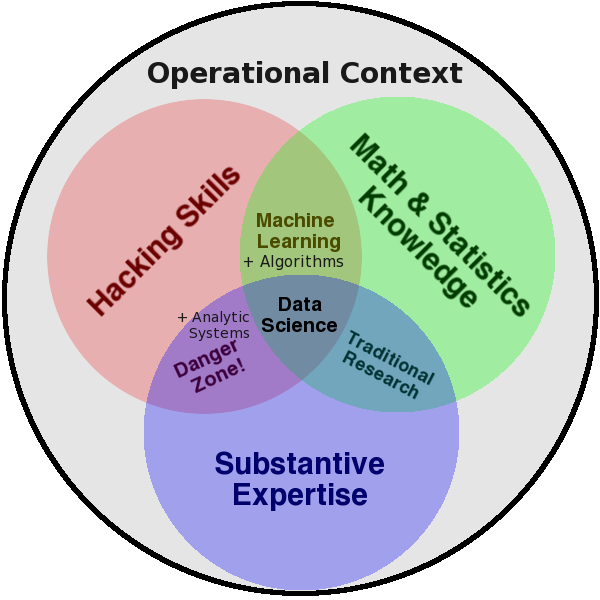
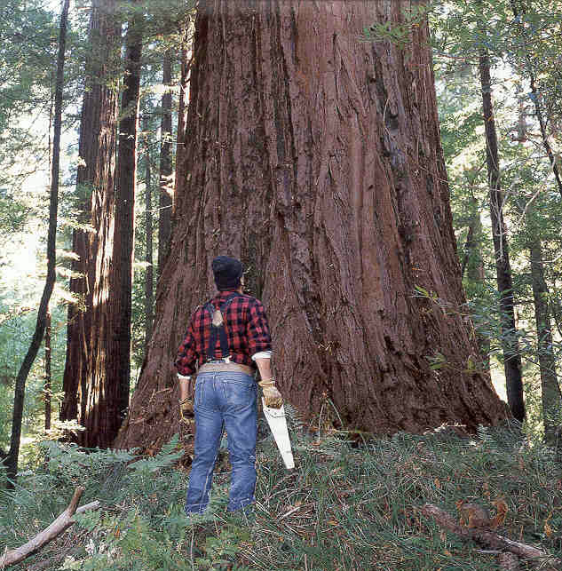
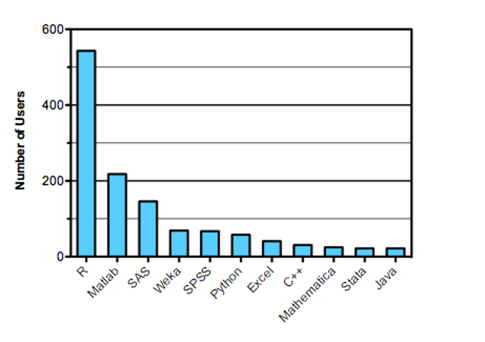

<!-- Limit image width and height -->

 
<!-- Center image on slide -->

## A Data Science Toolkit

   
    
   
* * * * 

Outfitting Production lines for Data Products

* * * * 
  
 
 
   
<small> 

[Michael A.Smith](http://www.linkedin.com/in/mikesmith42/), Sr. Analyst at ICF International

[Clarence Dillon](https://www.linkedin.com/in/cwdillon), Graduate Student at GMU's Krasnow Institute

for _2014 MORS Symposium_, WG {29, 33}
</small>

*** =pnotes

This is where we add some text to explain what's what and why we're doing this and stuff. This becomes metadata for the slide and it documents the code. 

--- .class #id 

### Introduction and Outline

1. Why we care about _Data Science_
1. Themes used throughout this presentation
1. Describing the _Industrial Data Flow_
1. Resources for your next steps

--- &vertical

### Why We Care About Data Science

* Currently trending
* There's so much more data now!
* Confluence of disciplines
* Production of insights and methods
* Reproducibility 

****

### New Popularity of Data Science

* A (new) way to integrate perspectives
* A way to leverage computer power
 - Speed, Volume, Reliability, Consistency
 - Processing power, parallelization
* Applied Science 
 

*** 

### Reproducibility

* Reproducibility vs Replicability
* Closest we can do with event and social data
 - not _completely_ scientific
 - better than nothing 
* Necessary for engineering the data process 
* Toolkit enables production of insights 
 
*** 

 

<small>Growth of Data[1]</small>

--- &vertical

### Presentation Themes 

* Process Steps 
 - Cross-industry Standard Process for Data Mining (CRISP-DM) [4]
 - Data Science as building a production line
* Big Data
 - This presentation is _NOT//NOT_ about big data
 - but, these tools are necessary for big data 

***

--- &vertical

### Data Science

* Sexiest job of the 21st Century [12]
* New kinds of data and inquiry necessitate a new set of skills
 - What distinguishes a data scientist
 - Databases contain data; data science generates data products
* Statistics: the grammar of data science
* A team sport

***

<small>Drew Conway and NIST [2]</small>

***

***

### Statistics & Math

* Right tool for the job
 - Friends don't let friends use Excel for stats [5], [8]
 - Pick the ecosystem that's right for you
* *nix Ecosystem:
 - R, Python
 - Octave
* Windows Ecosystem:
 - SAS/JMP, Stata
 - Tableau, NodeXL

<small>Strata Data Science Salary Survey 2013 [2]</small>

*** 

### Hacking

* 'nix environments (OSX, Linux)
 - C/C++, R (RCPP), Python, Java, Ruby, Perl, ... 
 - MySQL, Hadoop, MongoDB, Mahout, ...
 - D3, Google Charts, homegrown viz
* Windows
 - C#, VB.Net
 - SQL, Oracle, Excel
 - Tableau, other JavaScript
 
*** 

### Subject-Matter Expertise

* What to calculate 
 - What it means
 - How to approach a problem
* Why Soft Skills Matter [6]
 - area experts are driven fundamental question
 - statisticians & programmers focus on the analytic problem

***

***

---

### Process

* Acquire
* Clean
* Explore and Visualize
* Model and Analyze
* Products and Publications

--- &vertical

### Data Acquisition

* Data sources
 - Repositories (downloadable)
 - APIs (JSON, XML, ...) [9]
 - Databases (SQL, JSON, XML, ... )
* Big data 
 - (it'll be the last time we talk about it)
 - Hadoop, Pig, Hive
* Provenance
* Keep a copy of the raw data

*** 

### Sources

* Warehouses & Repos
* Accessibility
 - APIs
* Freedom
 - Lower the bar for entry
 - Invite discussion, validation, improvement

***

### Big Data

* Good data science is prerequisite to big data
* Importance of _repeatable_ processes
 - Map-Reduce
 - Continuous process of a data flow
* Like water treatment or electricity production
 - Data science == engineering the facility
 
 
*** 

### Provenance

* Validation and accreditation
 - What have you got
 - Where did it come from
 - Has somebody tampered with it
* How did your source get it
 - any pre-processing or amalgamation
 - original (field) data may be 'dirty'
 - machine-generated data may be 'buggy'

--- &vertical

### Cleaning Data

* Standardization
 - Units of Measure
 - Misspellings, Initials
 - Systematic or occasional differences
* Missing values
* Maintaining traceability

*** 

### Standardization

* Translating Units of Measure
 - standard libraries
 - explicit translations
* Dealing with typos and differences
 - Levenshtein distance
 - Differences in code lengths [7]
  - Java: 24, C++: 63, VB.Net: 20, C#: 39
  - Python: 15, PHP: 1, R: 2

*** 
 
### Missing Values

* Filter out records with missing values
* Simulate missing values
 - adding replacement records 
 - consider the impact on other correlations
* Replace with 0 or 'NA' explicitly

--- &vertical

### Explore Data

* Format, volume, shape, size, extent, ...
* Exploratory visualization
* Exploratory statistics (summary stats)

***

### Shape and Volume

* Format 
 - Open formats: CSV, TSV, XML, JSON
 - Closed formats: DTA, SAS, XLS(X)
* Shape
 - Long or wide, sparse or dense
 - Tabular, nested
* Size
 - How big will it be in program memory?
 - Does the JVM need a bigger heap size?
 - Can it be loaded bit-by-bit?

***
 
### Exploratory Viz

* Lattice (and other pair-wise/factor comparisons)
* Interactive graphics
 - ggplot2 (ggplot or qplot)
* Networks
 - layouts
 - trees and hierarchies
 

***

### Lattice Example

<small>Lattice[10]</small> 

***

### Visualization Sequiter 

***

### Exploratory Stats

* Summary statistics
 - Measures of central tendency
 - Compare to impressions from size/shape
* Autoregression

***

### Summary Stats Awareness

***

### More Summary Stats Awareness

--- &vertical

### Models & Analysis

* This is the 'secret sauce' for your data product
* Demonstrate the insight(s) from exploration and analysis
* Narrate the data story

***

### Regression

* Identifying dependent and independent factors
* Lingua Franca of statistical relationships
 - Correlation, way to deal with multiple factors
 - Reliable quantitative method to contextualize results
* First step in predictive statistics 

--- &vertical

### Product

* Reproducible research
* Sharing code & data
 - PDFs of tables are cruel and thwart the cause of science
 - PowerPoint is where data goes to die
* If you're product is good, it may deserve an API

***

### Reproducible research

* You care because you value your own time/data
 - ...or don't you?
 - Can you reproduce your own work 6 months later?
* Share the code as well as the raw data
* This is a science of building the assembly line as much as the products

***

### Data Products

* Think of this as the packaging step for manufactured products
* Documentation is like the instruction manual  
* Publication of reports
 - LaTeX and Sweave for printables
 - Markdown and javascript for the web
* Publication of data
 - CSV, JSON, text or other open format
 - Raw data and processed data as well as process and results

***

### APIs

* Selective mirror for your data
 - REST-ful service
 - "easy" does not (necessarily) mean "free"
* Why it's useful, before and after
* What you'll need to access most data
 - OAuth, OpenID, local accounts
 - PKI certificates

---

### Resources for More Info

* Local University Programs
 - GW: Business Analytics
 - GMU: Computational Informatics, Data Science
 - UMUC: Human-Computer Interaction, Systems Research
* Online
 - MOOCS: Coursera, EdX, Open Courseware
 - CodeCademy, Code School (O'reilly), Lynda
 - Blogs and newsletters: O'reilly, Is(R), ...
* Local
 - Data Community DC 
 - ...or your local Meetup
 - General Assembly

---

### Conclusion 

* Data Science is not just 'applied statistics'
 - Reproducibility (scripted processes)
 - Subject-matter Expertise, aka _Soft Skills_
 - Team sport (no unicorns)
* Toolkit make Data Science scalable, extensible
* Value added comes from:
 - Insights (not just data munging)
 - Designing the process/tools; reproducibilty

---

### References
<small>
* [1] (http://www.washingtonpost.com/wp-dyn/content/graphic/2011/02/11/GR2011021100614.html) "Rise of the Digital Information Age, __Washington Post__"
* [2] (http://oreilly.strata.com/salary-survey-or-something) "Strata Data Science Salary Survey"
* [3] (http://kaggle.org/blog/) "Kaggle Blog"
* [4] (http://en.wikipedia.org/wiki/Cross_Industry_Standard_Process_for_Data_Mining)
* [5] (http://homepage.stat.uiowa.edu/~jcryer/22s008/righttool.htm) "right tool for the job, Univ. Iowa Statistics"
* [6] (http://data-informed.com/soft-skills-matter-data-science/)"DataInformed - why soft skills matter "
* [7] (http://rosettacode.org/wiki/Levenshtein_distance) "Rosetta Code" 
* [8] (http://files.shareholder.com/downloads/ONE/2272984969x0x628656/4cb574a0-0bf5-4728-9582-625e4519b5ab/Task_Force_Report.pdf) "JP Morgan fined for use of Excel to model risk"
* [9] (http://orchestrate.io/blog/2014/02/12/what-you-should-demand-from-apis/) "What You Should Demand from APIs"
* [10] (http://lmdvr.r-forge.r-project.org/figures/figures.html) "Deepayan Sarkar, __Lattice: Multi-variate Data Visualization with R__"
* [11] (http://www.edureka.in/blog/types-of-data-scientists/?imm_mid=0bd168&cmp=em-strata-na-na-newsltr_20140528_elist) "Types of Data Scientist"
* [12] (http://www.nytimes.com/2009/08/06/technology/06stats.html)"New York Times __For Today’s Graduate, Just One Word: Statistics__, August 5, 2009"
* [13] (http://xkcd.com/833/) "XKCD, 'Commitment' "

</small>

---

### Contacting Us

* Michael A Smith
 - ICF International 
 - [mike.smith@icfi.com](mike.smith@icfi.com)
* Clarence Dillon
 - GMU & Fast Forward Analytics, LLC
 - [cdillon2@gmu.edu](cdillon2@masonlive.gmu.edu), [cwdillon@fastforwardanalytics.com](cwdillon@fastforwardanalytics.com) 

