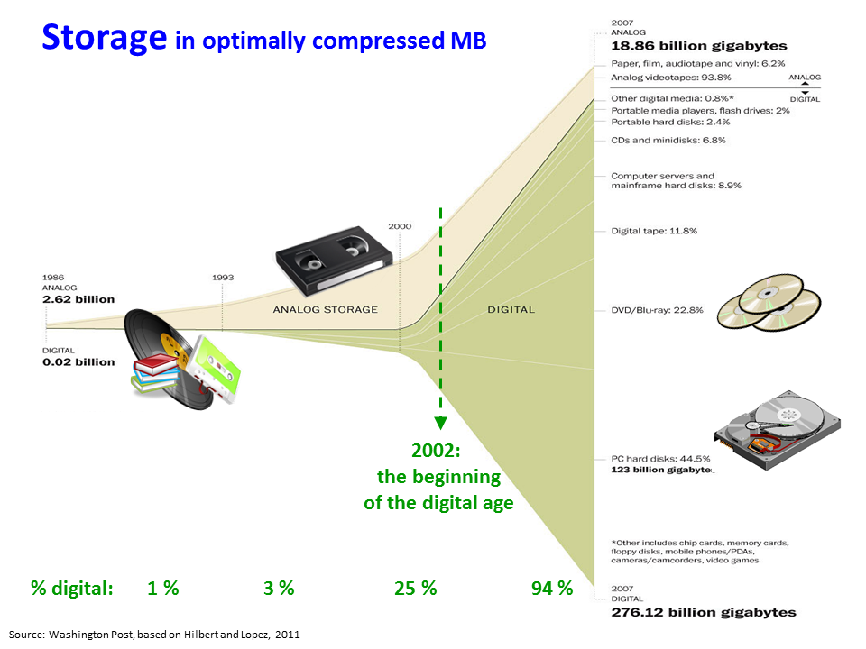
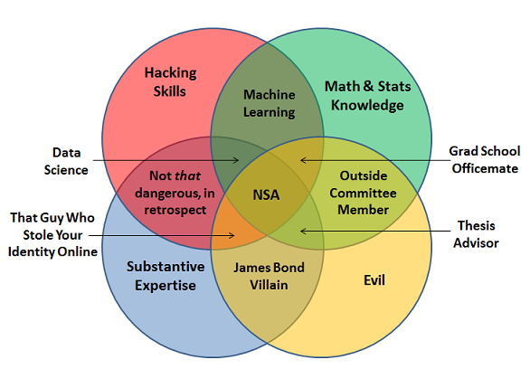

<!-- Limit image width and height -->

 
<!-- Center image on slide -->

## A Data Science Toolkit

   
    
   
* * * * 

Outfitting Production lines for Data Products

* * * * 
  
 
 
   
<small> 
We'll probably want to build this out with names and logos and stuff

[Michael A.Smith](http://icfi.com)

[CW Dillon](http://www.css.gmu.edu/?q=node/15) 

for _2014 MORS Symposium_, WG {29, 33}
</small>

*** =pnotes

This is where we add some text to explain what's what and why we're doing this and stuff. This becomes metadata for the slide and it documents the code. 

--- .class #id 

### Introduction and Outline

1. Why do we care about data science?
1. What do we mean by _Data Science_?
1. Describing the _Industrial Data Flow_
1. Resources for your next steps

--- &vertical

### Why Do We Care About Data Science?
* Growth of data
* Confluence of...
 - Statistics
 - Programming (hacking)
 - "Soft skills"
* Production of insights 

****

### Growth of Data

Growth of Data[1]

****

### Data Science Venn Diagram

*** 

### Data Process

* Reproducibility is much of what makes this a _science_
* Using the toolkit for end-to-end production of insights
* 

--- &vertical

### Presentation Themes 

* Ecosystems
 - O'reilly/Strata Salary Survey, 2013
 - Kaggle Competition Entries, 2012
* Process Steps
 - CRISP-DM
 - Production Line
* Big Data
 - This presentation is _NOT//NOT_ about big data
 - but, these tools are necessary for big data
 - continuous repetition

***

### Stats

* Right tool for the job
 - Friends don't let friends use Excel for stats
* OS Ecosystem:
 - R, Python, Octave
* $ Ecosystem:
 - SAS/JMP, Matlab, Stata
* Windows Ecosystem:
 -R, Python, Tableau, NetworkX

<small> source</small>

*** 

### Programming

* *nix environments (OSX, Linux)
 - C/C++, 
 - R (RCPP package)
 - Python
 - JavaScript (Node)
 - Never seen anything done in ObjectiveC
* Windows
 - C#
 - VB.Net
 
***

### Subject-Matter Expertise

* What to calculate, what it means
* 

---

### Themes

* Ecosystems of tools 
 - Open Source ecosystem
 - Windows ecosystem
* Relevance to _process_ steps
* Relevence to _big data_ 
 - yah, we know you were thinking about it...
 - ...sigh...

---

### Process

* Inputs
* Clean
* Explore
* Model
* Products

--- &vertical

### Process Inputs

* Data Sources
* Big data 
* Provenance

*** 

### Sources

* Accessibility
* Freedom

***

### Big Data

* Flows
* Map-Reduce
* Importance of _repeatable_ processes
* Documenting processes 

*** 

### Provenance

* What have you got
* Where did it come from
* Where did they get it

--- &vertical

### Cleaning Data

* Standardization
* Missing values
* 

*** 

### Standardization

* Dealing with typos and differences
 - Who worked on this briefing?
  - CW Dillon
  - Clarence W Dillon
  - C. W. Dillion
 - (FI {+ iff MI} + Levenstein distance < 3 in Lastname)
* Translating Units of Measure
* 
 
--- &vertical

### Explore Data

* Exploratory 
* Exploratory visualization
* Volume (size and extent)
* Shape

***

### Shape and Volume

* Format 
 - Open formats: CSV, TSV, XML
 - Closed formats: .DTA, .SAS, .XLS(X)
* Shape
 - Long, sparse
 - Tabular, nested
* 

***
 
### Exploratory Viz

* Lattice
* Interactive 

***

### Exploratory Stats

* Auto Regression
* Measures of central tendency

***

### Problems with Summary Stats

compare whisker plots with jittered plots: image

--- &vertical

### Models & Analysis

* This is the 'secret sauce' for your data product
* 

***

### Regression

* What matters?

***

### Fit

* Quality control

--- &vertical

### Product

* Reproducable research
* Sharing code & data
 - PDFs of tables are cruel and thwart the cause of science
 - PowerPoint is where data goes to die
* If you're product is good, it deserves an API

***

### Reproducable research

* You care because you value your own time/data
* ...or don't you?
* Share the code as well as the data
* 

***

### Data Products

* Think of this as the packaging step for manufactured products
* Documentation
* 

***

### APIs

* What
* Why
* How
 - automated API tools
 
---

### Resources for More Info

* Local University Education
 - GW program
 - GMU program
 - UMUC program
* MOOCs
 - Coursera
 - OpenEdX
* Local
 - DC2 (or your local Meetup)
 - General Assembly

---

### References
[1]: http://somesite.net "Where Did This Come From?"
[2]: http://oreilly.strata.com/salary-survey-or-something "Strata"
[3]: http://kaggle.org "Kaggle Blog"

---
### Contacting Us

* Michael A Smith
 - ICF, Int'l 
 - email...
* Clarence Dillon
 - GMU & Complexity Studies
 - studycomplexity.org

